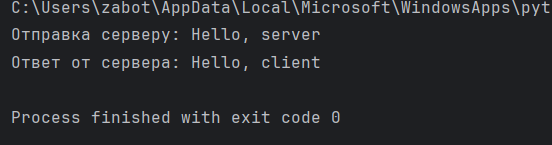
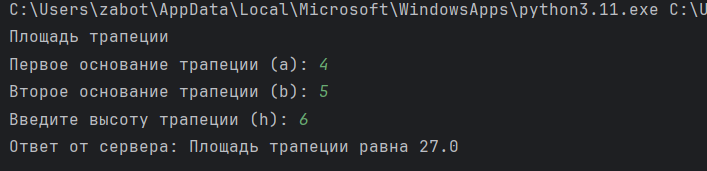
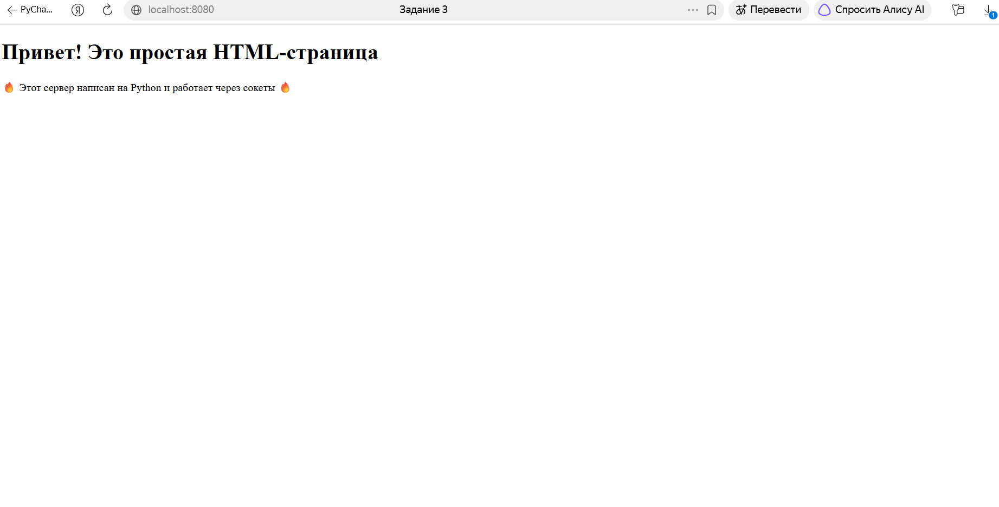
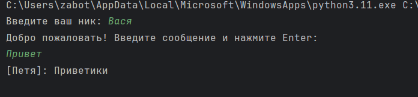
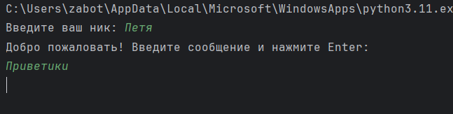
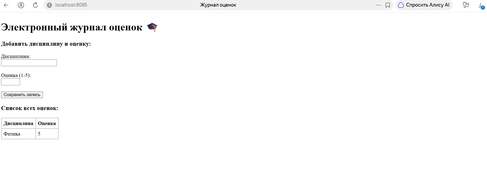

# Лабораторная работа №1: Работа с сокетами в Python

**Выполнила:** Заботкина Марина  
**Группа:** К3339


---

## 1. Выполнение заданий

### Задание 1. Клиент-серверный обмен по протоколу UDP

#### Описание:
Клиент отправляет серверу строку «Hello, server». Сервер считывает ее через сокет `SOCK_DGRAM` и отправляет клиенту ответ «Hello, client».

#### Исходный код:

`task1/server.py`:
```python
import socket

server_socket = socket.socket(socket.AF_INET, socket.SOCK_DGRAM)
server_socket.bind(('localhost', 8080))
print("UDP Сервер запущен на порту 8080...")

while True:
    data, client_address = server_socket.recvfrom(1024)
    message = data.decode()
    print(f"Получено от {client_address}: {message}")

    response = "Hello, client"
    server_socket.sendto(response.encode(), client_address)
```

`task1/client.py`:
```python
import socket

server_socket = socket.socket(socket.AF_INET, socket.SOCK_DGRAM)
server_socket.bind(('localhost', 8080))
print("UDP Сервер запущен на порту 8080...")

while True:
    data, client_address = server_socket.recvfrom(1024)
    message = data.decode()
    print(f"Получено от {client_address}: {message}")

    response = "Hello, client"
    server_socket.sendto(response.encode(), client_address)
```

#### Результат работы:


---

### Задание 2. Математические расчеты по TCP (Вариант 3)

#### Описание:
Клиент вводит с клавиатуры параметры для вычисления площади трапеции ($a$, $b$, $h$) и передает их серверу по протоколу TCP. Сервер выполняет вычисления по формуле $S = \frac{a + b}{2} \cdot h$ и возвращает результат клиенту.

#### Исходный код:

`task2/server.py`:
```python
import socket

server_socket = socket.socket(socket.AF_INET, socket.SOCK_STREAM)
server_socket.bind(('localhost', 8080))
server_socket.listen(1)
print("Сервер вычисления площади трапеции запущен на порту 8080...")

while True:
    client_connection, client_address = server_socket.accept()
    print(f"Подключение от {client_address}")

    request = client_connection.recv(1024).decode()
    print(f"Получены параметры от клиента: {request}")

    a_str, b_str, h_str = request.split()
    a = float(a_str)
    b = float(b_str)
    h = float(h_str)

    if a <= 0 or b <= 0 or h <= 0:
        response = "Основания и высота трапеции должны быть больше нуля"
    else:
        s = ((a + b) / 2) * h
        response = f"Площадь трапеции равна {s}"

    client_connection.sendall(response.encode())
    client_connection.close()
```

`task2/client.py`:
```python
import socket

server_socket = socket.socket(socket.AF_INET, socket.SOCK_DGRAM)
server_socket.bind(('localhost', 8080))
print("UDP Сервер запущен на порту 8080...")

while True:
    data, client_address = server_socket.recvfrom(1024)
    message = data.decode()
    print(f"Получено от {client_address}: {message}")

    response = "Hello, client"
    server_socket.sendto(response.encode(), client_address)
```

#### Результат работы:


---

### Задание 3. Отдача файла `index.html` через HTTP-сокет

#### Описание:
Сервер слушает входящие TCP-подключения. При обращении через браузер сервер читает локальный файл `index.html` и возвращает HTTP-ответ с кодом 200 OK.

#### Исходный код:

`task3/index.html`:
```html
<!DOCTYPE html>
<html lang="en">
<head>
    <meta charset="UTF-8">
    <title>Задание 3</title>
</head>
    <h1>Привет! Это простая HTML-страница</h1>
    <p>🔥 Этот сервер написан на Python и работает через сокеты 🔥</p>
<body>

</body>
</html>
```

`task3/server.py`:
```python
import socket

HOST = 'localhost'
PORT = 8080

server_socket = socket.socket(socket.AF_INET, socket.SOCK_STREAM)
server_socket.bind((HOST, PORT))
server_socket.listen(5)
print(f"HTTP сервер запущен на http://{HOST}:{PORT} ...")

with open('index.html', 'r', encoding='utf-8') as f:
    html_content = f.read()

while True:
    client_connection, client_address = server_socket.accept()
    request = client_connection.recv(1024).decode()

    http_response = (
        "HTTP/1.1 200 OK\r\n"
        "Content-Type: text/html; charset=UTF-8\r\n"
        f"Content-Length: {len(html_content.encode('utf-8'))}\r\n"
        "Connection: close\r\n"
        "\r\n"
        + html_content
    )

    client_connection.sendall(http_response.encode())
    client_connection.close()
```

#### Результат работы:


---

### Задание 4. Многопользовательский чат (TCP + Threading)

#### Описание:
Реализован чат на базе протокола TCP с поддержкой нескольких одновременных подключений. Сервер запускает отдельный поток для каждого подключенного клиента и рассылает сообщения всем остальным участникам (broadcast).

#### Исходный код:

`task4/server.py`:
```python
import socket
import threading

server_socket = socket.socket(socket.AF_INET, socket.SOCK_STREAM)
server_socket.bind(('localhost', 8080))
server_socket.listen()
print("Cервер запущен на порту 8080...")

clients = []

def broadcast(message, sender_connection):
    for client in clients:
        if client != sender_connection:
            try:
                client.sendall(message)
            except:
                clients.remove(client)

def handle_client(client_connection, client_address):
    print(f"Новый участник подключился: {client_address}")
    while True:
        try:
            message = client_connection.recv(1024)
            if not message:
                break
            broadcast(message, client_connection)
        except:
            break

    clients.remove(client_connection)
    client_connection.close()
    print(f"Участник {client_address} отключился.")

while True:
    client_connection, client_address = server_socket.accept()
    clients.append(client_connection)
    thread = threading.Thread(target=handle_client, args=(client_connection, client_address))
    thread.start()
```

`task4/client.py`:
```python
import socket
import threading

nickname = input("Введите ваш ник: ")

client_socket = socket.socket(socket.AF_INET, socket.SOCK_STREAM)
client_socket.connect(('localhost', 8080))

def receive_messages():
    while True:
        try:
            msg = client_socket.recv(1024).decode()
            print(msg)
        except:
            print("Соединение разорвано.")
            client_socket.close()
            break

recv_thread = threading.Thread(target=receive_messages)
recv_thread.daemon = True
recv_thread.start()

print("Добро пожаловать! Введите сообщение и нажмите Enter:")
while True:
    text = input()
    message = f"[{nickname}]: {text}"
    client_socket.sendall(message.encode())
```

#### Результат работы:



---

### Задание 5. Веб-сервер обработки GET и POST

#### Описание:
Реализован веб-сервер на базе класса `MyHTTPServer`:
* Сервер считывает запросы построчно `conn.makefile()`;
* Обрабатывает метод **GET**, считывая шаблон `index.html` и отображая таблицу накопленных оценок;
* Обрабатывает метод **POST**, считывая тело запроса, декодируя URL-параметры формы (`unquote`) и сохраняя пару «Дисциплина - Оценка» в список.

#### Исходный код:

`task5/index.html`:
```html
<!DOCTYPE html>
<html lang="ru">
<head>
    <meta charset="UTF-8">
    <title>Журнал оценок</title>
</head>
<body>
    <h1>Электронный журнал оценок 🎓</h1>

    <h3>Добавить дисциплину и оценку:</h3>
    <form method="POST" action="/">
        <label>Дисциплина:</label><br>
        <input type="text" name="subject" required><br><br>

        <label>Оценка (1-5):</label><br>
        <input type="number" name="grade" min="1" max="5" required><br><br>

        <input type="submit" value="Сохранить запись">
    </form>

    <h3>Список всех оценок:</h3>
    <table border="1" cellpadding="6" cellspacing="0">
        <tr>
            <th>Дисциплина</th>
            <th>Оценка</th>
        </tr>
        {{ grades_table }}
    </table>
</body>
</html>
```

`task5/server.py`:
```python
import socket
import sys
from urllib.parse import unquote


class MyHTTPServer:

    def __init__(self, host, port, name):
        self.host = host
        self.port = port
        self.name = name
        self.grades = []

    def serve_forever(self):
        server_socket = socket.socket(socket.AF_INET, socket.SOCK_STREAM)
        server_socket.setsockopt(socket.SOL_SOCKET, socket.SO_REUSEADDR, 1)
        server_socket.bind((self.host, self.port))
        server_socket.listen()
        print(f"[{self.name}] Сервер запущен на http://{self.host}:{self.port}")

        while True:
            conn, _ = server_socket.accept()
            self.serve_client(conn)

    def serve_client(self, conn):
        rfile = conn.makefile("r", encoding="utf-8")

        method, url = self.parse_request(rfile)
        if not method:
            conn.close()
            return

        headers = self.parse_headers(rfile)

        body = ""
        if method == "POST":
            content_length = int(headers.get("Content-Length", 0))
            if content_length > 0:
                body = rfile.read(content_length)

        status_code, reason, response_body = self.handle_request(
            method, url, body
        )
        self.send_response(conn, status_code, reason, response_body)
        conn.close()

    def parse_request(self, rfile):
        line = rfile.readline()
        if not line:
            return None, None

        words = line.split()
        return words[0], words[1]

    def parse_headers(self, rfile):
        headers = {}
        while True:
            line = rfile.readline()
            if line in ("\r\n", "\n", ""):
                break
            key, value = line.split(":", 1)
            headers[key.strip()] = value.strip()
        return headers

    def handle_request(self, method, url, body):
        if method == "POST":
            subject, grade = "", ""
            pairs = body.split("&")
            for pair in pairs:
                if "=" in pair:
                    k, v = pair.split("=", 1)
                    if k == "subject":
                        # Раскодируем русские буквы
                        subject = unquote(v.replace("+", " "))
                    elif k == "grade":
                        grade = v

            if subject and grade:
                self.grades.append({"subject": subject, "grade": grade})
                print(f"[POST] {subject} -> {grade}")

        rows = ""
        for item in self.grades:
            rows += f"<tr><td>{item['subject']}</td><td>{item['grade']}</td></tr>"

        if not rows:
            rows = "<tr><td colspan='2'>Записей пока нет</td></tr>"

        with open("grade.html", "r", encoding="utf-8") as f:
            template = f.read()

        html_body = template.replace("{{ grades_table }}", rows)
        return 200, "OK", html_body

    def send_response(self, conn, status_code, reason, body):
        status_line = f"HTTP/1.1 {status_code} {reason}\r\n"
        headers = (
            f"Content-Type: text/html; charset=UTF-8\r\n"
            f"Content-Length: {len(body.encode('utf-8'))}\r\n"
            f"Connection: close\r\n"
        )
        conn.sendall(status_line.encode("utf-8"))
        conn.sendall(headers.encode("utf-8"))
        conn.sendall(b"\r\n")
        conn.sendall(body.encode("utf-8"))


if __name__ == "__main__":
    host = sys.argv[1] if len(sys.argv) > 1 else "localhost"
    port = int(sys.argv[2]) if len(sys.argv) > 2 else 8085
    name = sys.argv[3] if len(sys.argv) > 3 else "MyHTTPServer"

    serv = MyHTTPServer(host, port, name)
    try:
        serv.serve_forever()
    except KeyboardInterrupt:
        pass
```

#### Результат работы:


---

## 3. Вывод
В ходе выполнения лабораторной работы №1 были практически освоены принципы работы с сетевыми сокетами в Python:
1. Изучены протоколы транспортного уровня UDP и TCP, реализована надежная передача данных и неблокирующая многопоточная обработка запросов на базе библиотеки `threading`.
2. Реализована обработка протокола HTTP/1.1 на низком уровне без использования веб-фреймворков.
3. Разработан веб-сервер на базе класса `MyHTTPServer`, корректно обрабатывающий HTTP-методы GET и POST.

